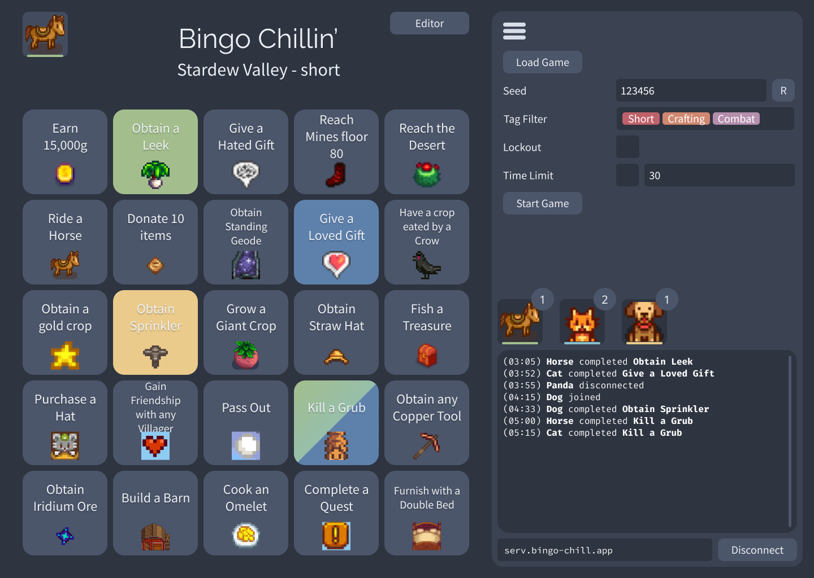

# Bingo Chillin'

Bingo Chillin' is a bingo web-app designed for playing video game bingos with friends.

There are a few similar apps around (for example https://bingosync.com or just search
any game + bingo, e.g. "zelda bingo") however I wanted a go at making one more tailored
for my desires.

Main features:

- Real-time multiplayer
- Customizable bingo tasks
- Designed to be self-hostable with minimal friction
- Lockout-support

This repo is a mono-repo containing the server (node.js websocket server),
the client (NextJs web app), and a few shared resources.

- [Bingo Chillin'](#bingo-chillin)
  - [Overview](#overview)
    - [Game Setup](#game-setup)
  - [Get Started](#get-started)
    - [Server](#server)
    - [Client](#client)
  - [Technical Stuff](#technical-stuff)
    - [Stack / Buzzword Sales Pitch](#stack--buzzword-sales-pitch)
  - [Mock Image](#mock-image)

## Overview

Disclaimer: This app is not intended to be run as a public SaaS. It is more
designed towards being used as a tool together with friends that play fair
and relies a lot on an honor system.

There is no server-authority or administration for a game session. This means
that any player can (re)start a game (which will regenerate the board and reset
progress), and that any player can claim to have completed any task. There
also isn't any filtering for inappropriate names or icons. The Game Engine is
also relatively lean and does not for example prevent players from still playing
after the set time limit has run out.

### Game Setup

In order to play, a game setup must be loaded both on the server and the client(s).

A game setup contains the game name (e.g. "Super Mario 64"), some metadata like
the author and date of the setup, and a list of tasks that a player can complete
(e.g. "Clear Level 1" or "Obtain 10 Stars").

Each task can have a set of tags that can be used for filtering when generating the
board (e.g. "short", "combat", "dlc" etc.).

Game setups can be created in the web-app (**WIP**).

A game setup is stored as a `.json` file. The server needs this file locally, but
each client (player) can load the setup directly from the web-app.

For an example of a game setup check [game-setup-example.json](/docs/game-setup-example.json).

> Note: Due to bandwidth concerns game setups are not synced between
> the server or any of its players. This means that everyone must have the exact same
> game setup loaded. To help verify this, each game setup has a **checksum** value
> which is a short number unique to that setup. The server sends this checksum to
> all players and the players' verify their own checksum against this to check that
> everything is OK.

## Get Started

### Server

> Note: A server only supports one concurrent game. If multiple concurrent games
> are desired then multiple server instances should be started and routed through
> some mechanism outside of the scope of this app.

See [Server README](/packages/server/README.md) for instructions.

### Client

See [Client README](/packages/client/README.md) for instructions.

## Technical Stuff

### Stack / Buzzword Sales Pitch

- Language: [Typescript](https://www.typescriptlang.org/)
- Frontend Framework: [NextJs](https://nextjs.org/) (React)
- Theme/Styling: [Tailwind](https://tailwindcss.com/) (with [Nord Theme](https://www.nordtheme.com/) palette)
- Tests: [Jest](https://jestjs.io/)
- Storybook: [Ladle](https://ladle.dev/)
- Design Frameworks: [Atomic Design](https://xd.adobe.com/ideas/process/ui-design/atomic-design-principles-methodology-101/), [SOLID](https://en.wikipedia.org/wiki/SOLID) / Clean Code (ish)
- Multiplayer handled with WebSockets ([ws](https://github.com/websockets/ws)) using Protocol Buffers ([protobuf.js](https://github.com/protobufjs/protobuf.js))

## Mock Image

