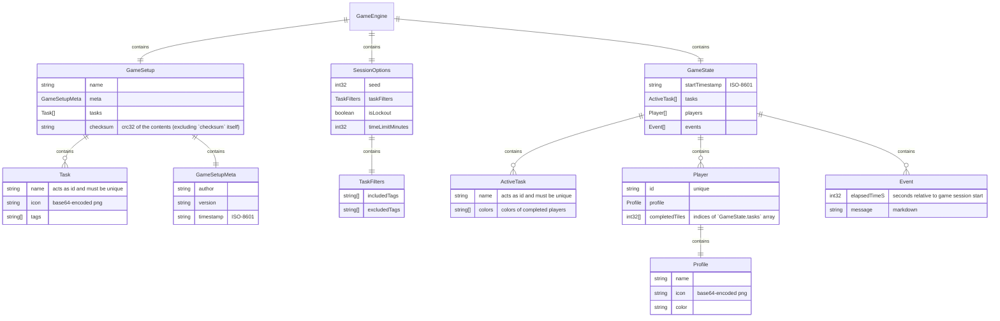
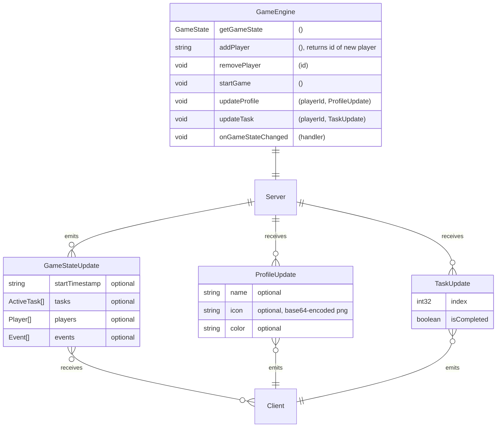

# Diagrams

## Core Game Engine

```mermaid
erDiagram
  Task {
    string name "acts as id and must be unique"
    string icon "base64-encoded png"
    string[] tags
  }

  GameSetupMeta {
    string author
    string version
    string timestamp "ISO-8601"
  }

  GameSetup {
    string name
    GameSetupMeta meta
    Task[] tasks
    string checksum "crc32 of the contents (excluding `checksum` itself)"
  }

  GameSetup ||--|| GameSetupMeta : contains
  GameSetup ||--o{ Task : contains

  TaskFilters {
    string[] includedTags
    string[] excludedTags
  }

  SessionOptions {
    int32 seed
    TaskFilters taskFilters
    boolean isLockout
    int32 timeLimitMinutes
  }

  SessionOptions ||--|| TaskFilters : contains

  ActiveTask {
    string name "acts as id and must be unique"
    string[] colors "colors of completed players"
  }

  Profile {
    string name
    string icon "base64-encoded png"
    string color
  }

  Player {
    string id "unique"
    Profile profile
    int32[] completedTiles "indices of `GameState.tasks` array"
  }

  Player ||--|| Profile : contains

  Event {
    int32 elapsedTimeS "seconds relative to game session start"
    string message "markdown"
  }

  GameState {
    string startTimestamp "ISO-8601"
    ActiveTask[] tasks
    Player[] players
    Event[] events
  }

  GameState ||--o{ ActiveTask : contains
  GameState ||--o{ Player : contains
  GameState ||--o{ Event : contains

  GameEngine {
  }

  GameEngine ||--|| GameSetup : contains
  GameEngine ||--|| GameState : contains
  GameEngine ||--|| SessionOptions : contains
```

## Communication

```mermaid
erDiagram
  GameEngine {
    GameState getGameState "()"
    string addPlayer "(), returns id of new player"
    void removePlayer "(id)"
    void startGame "()"
    void updateProfile "(playerId, ProfileUpdate)"
    void updateTask "(playerId, TaskUpdate)"
    void onGameStateChanged "(handler)"
  }

  ProfileUpdate {
    string name "optional"
    string icon "optional, base64-encoded png"
    string color "optional"
  }

  TaskUpdate {
    int32 index
    boolean isCompleted
  }

  GameStateUpdate {
    string startTimestamp "optional"
    ActiveTask[] tasks "optional"
    Player[] players "optional"
    Event[] events "optional"
  }

  GameEngine ||--|| Server : ""

  Server ||--o{ GameStateUpdate : emits
  Server ||--o{ ProfileUpdate : receives
  Server ||--o{ TaskUpdate : receives

  GameStateUpdate }o--o{ Client : receives
  ProfileUpdate }o--|| Client : emits
  TaskUpdate }o--|| Client : emits
```
