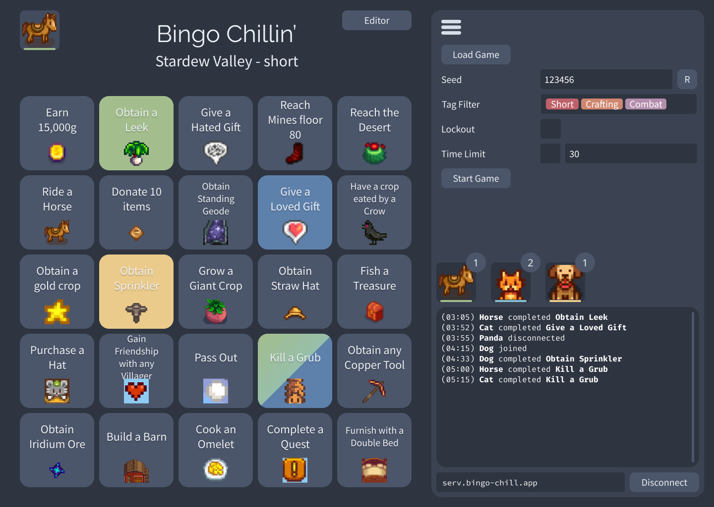
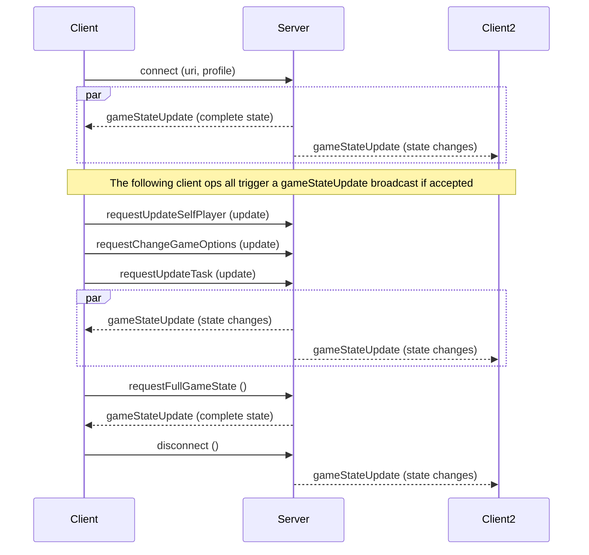

# Bingo Chillin'

Bingo Chillin' is a generic bingo-board maker with multiplayer support.

This repo is the (web) frontend.

TODO:

- Components & layout
- Data structure spec
- AsyncAPI spec
- Server / message broker
- Client / message publisher + consumer
- Editor
- Save/Load feature

## Tech Stuff

- Language: [Typescript](https://www.typescriptlang.org/)
- Framework: [NextJs](https://nextjs.org/) (React)
- Theme/Styling: [Tailwind](https://tailwindcss.com/) (with [Nord Theme](https://www.nordtheme.com/) palette)
- Tests: [Jest](https://jestjs.io/)
- Storybook: [Ladle](https://ladle.dev/)
- Design Frameworks: [Atomic Design](https://xd.adobe.com/ideas/process/ui-design/atomic-design-principles-methodology-101/), [SOLID](https://en.wikipedia.org/wiki/SOLID) / Clean Code (ish)
- Multiplayer handled with WebSockets ([ws](https://github.com/websockets/ws)) using Protocol Buffers ([protobuf.js](https://github.com/protobufjs/protobuf.js))

## Mock Image

## Net stuff

