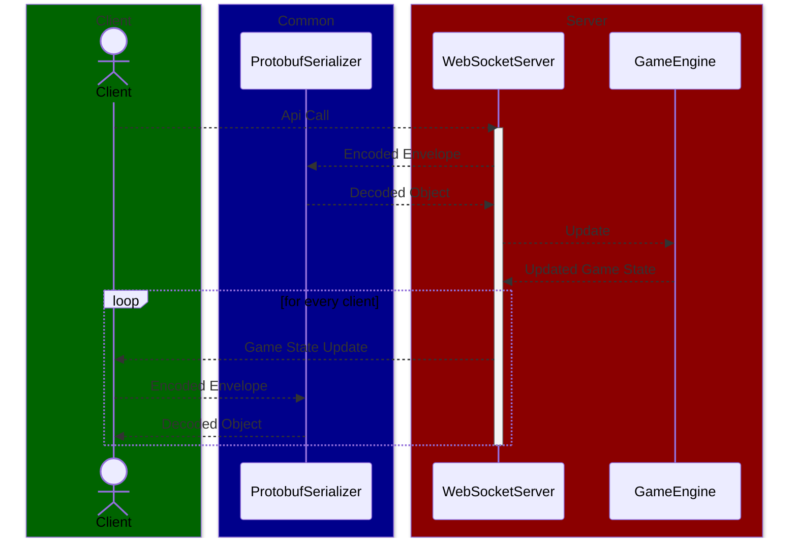

# Bingo Chillin' Server

TODO

## Architecture

```mermaid
sequenceDiagram
  box DarkGreen Client
    actor Client
  end

  box DarkBlue Common
    participant ProtobufSerializer
  end

  box DarkRed Server
    participant WebSocketServer
    participant GameEngine
  end

  Client -->> WebSocketServer: Api Call
  activate WebSocketServer
    WebSocketServer -->> ProtobufSerializer: Encoded Envelope
    ProtobufSerializer -->> WebSocketServer: Decoded Object
    WebSocketServer -->> GameEngine: Update
    GameEngine -->> WebSocketServer: Updated Game State
    loop for every client
      WebSocketServer -->> Client: Game State Update
      Client -->> ProtobufSerializer: Encoded Envelope
      ProtobufSerializer -->> Client: Decoded Object
    end
  deactivate WebSocketServer
```
