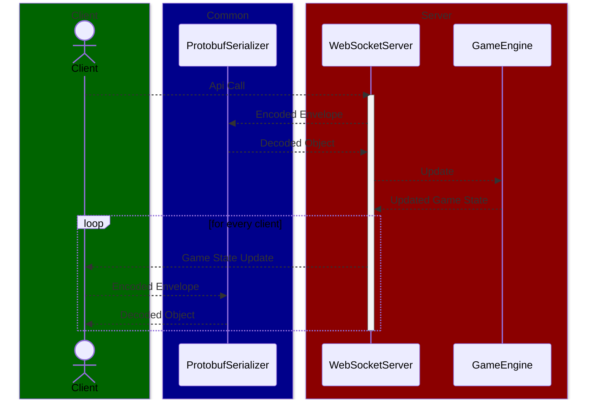

# Bingo Chillin' Server

The server is a core part of the application. It's a NodeJs program that
handles connections of players and manages the game state and changes to
it.

- [Bingo Chillin' Server](#bingo-chillin-server)
  - [Getting Started](#getting-started)
  - [Architecture](#architecture)

## Getting Started

Go to the appropriate and install the dependencies:

```zsh
cd packages/server
yarn
```

You need to have a valid game setup json file ready to run the server. To
start the server run:

```zsh
yarn start --gameFile <path to game setup json>
```

From here clients can connect to the ip and port of the server running. You
can customize the port by creating an `.env` file (follow the
[.env.example](.env.example) file). The default port is `1337`.

## Architecture


